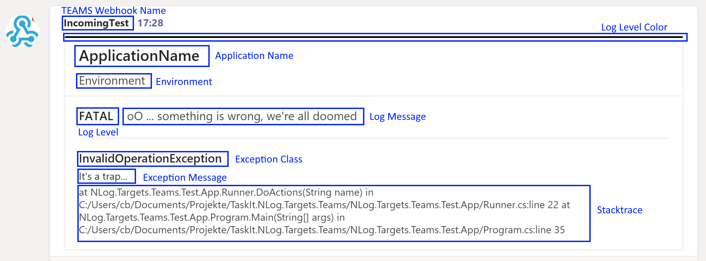

# NLog.Targets.Teams
[](https://www.nuget.org/packages/NLog.Targets.Teams)
[](https://www.nuget.org/packages/NLog.Targets.Teams)  

Simple [NLog](https://nlog-project.org/) logging target for [Microsoft TEAMS](https://products.office.com/en/microsoft-teams/group-chat-software?market=en).

The Target uses the TEAMS Incoming webhook.

For more Information about webhhoks in Teams read:
- https://docs.microsoft.com/en-us/microsoftteams/platform/webhooks-and-connectors/what-are-webhooks-and-connectors
- https://docs.microsoft.com/en-us/microsoftteams/platform/webhooks-and-connectors/how-to/add-incoming-webhook

The target has a built in layout for the Teams card so you don't have to design it by yourself.

## Installation
Simply add the nuget dependency. NLog will do th rest (see: [Configuration - NLog](#NLog)).

## Configuration

### NLog

See: https://github.com/NLog/NLog/wiki/Register-your-custom-component#separate-dll-and-auto-register-non-net-core

### MS Teams

Create a incoming Webhook in a Teams channel.<br/>
See: https://docs.microsoft.com/en-us/microsoftteams/platform/webhooks-and-connectors/how-to/add-incoming-webhook

### Your Application

Configure the target in your `nlog.config`.
The NLog type of the Target is: `MsTeams`

### Parameters

Parameter | Required | Type | Description |
--------- | -------- | ---- | ----------- |
Url | true | string  (layout) | Ms Teams incoming webhook URL |
ApplicationName | true | string  (layout) | the name of your application |
Environment | true | string  (layout) | the stage your application runs in (e.g. develop, staging, production ) |
~~UseLayout~~ |  |  | Deprecated | 
CardImpl | false | string | Fully qualified name of the custom messageCard implementation.<br>If omitted, the internal default implementation will be used. | 
CardAssembly | false | string | Name of the assembly which holds the _CardImpl_.<br/> Required if you use a cutom messageCard implementation. | 

### Sample Configuration
```
<target xsi:type="MsTeams" 
            name="whatever"             
            Url="<your TEAMS incoming webhook url>"          
            ApplicationName="<your application name>"
            Environment="<executing environment>" />
```

### Default Teams Message Card
The package provides an interface for implementing Teams message cards (`IMessageCard`).  
If the Parameters `CardImpl` and `CardAssembly` ar omitted, the default (built in) `IMessageCard` implementation will be used.
The screenshot shows the built in Teams message card.

The color schema of the upper separator line will change according to the log level.
The colors are:

Trace | Debug | Info | Warning | Error | Fatal |
--------- | -------- | -------- | -------- | -------- | -------- |
White | Green | Blue | Yellow | Red | Black |

The exception section will only be visible, when an exception is logged.

### Custom Teams Message Card
To use your own message card, implement the Interface `IMessageCard` (provided by the Package) and set the Parameters `CardImpl` and `CardAssembly` in the NLog config.<br/>
For more information about the Teams message card formatting please read https://docs.microsoft.com/en-us/outlook/actionable-messages/message-card-reference .


# Test App
This solution includes a console App for testing.<br/> 
Bevor you run it, you must add yout Teams webhook Url in the nlog.config inluded in the App (marked with: '<i>XXX PUT YOUR URL IN HERE XXX</i>').<br/>
The demo app also inlcudes a custom `IMessageCard` implementation (and NLog config), but its very similar to the default implementation. I've only changed the colors.


# Changelog

### 2.0.0
* __breaking change__: removed parameter `UseLayout`
* __breaking change__: NLog Layout parameter will be ignored
* Parameters (`Url`, `ApplicationName`, `Environment`) are now NLog layouts, which enables variable support
* __new optional parameters__: `CardImpl` and `CardAssembly` for easier custom message Card implementation
* added interface `IMessageCard` for easier custom message Card implementation
* Demo app updated to net5.0
* Demo app updated for easier adaption

